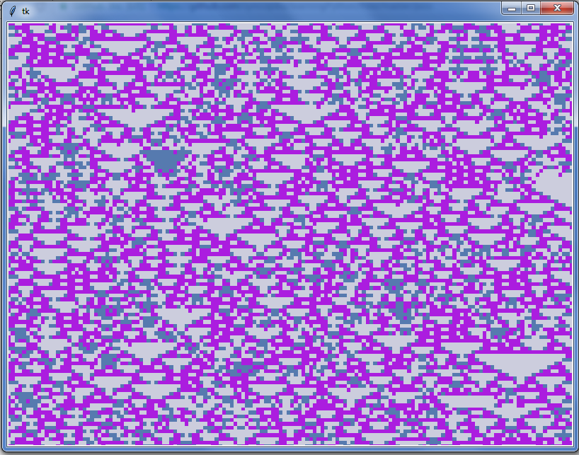

relies on the file in lab4. that's it! can be run on the command-line, which accepts 3 arguments: cell array size, number of states, and number of neighbors. press 'enter' to stop the program.
    

